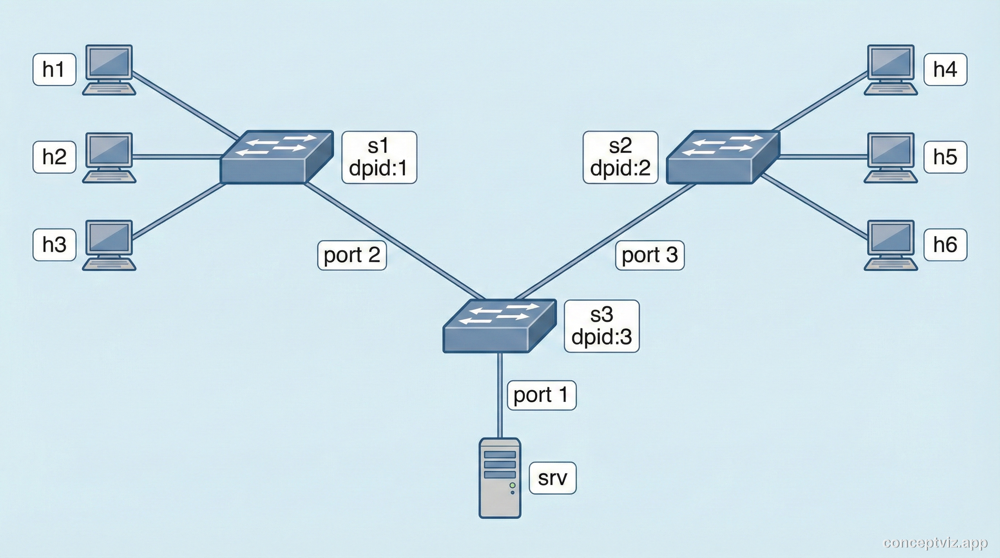
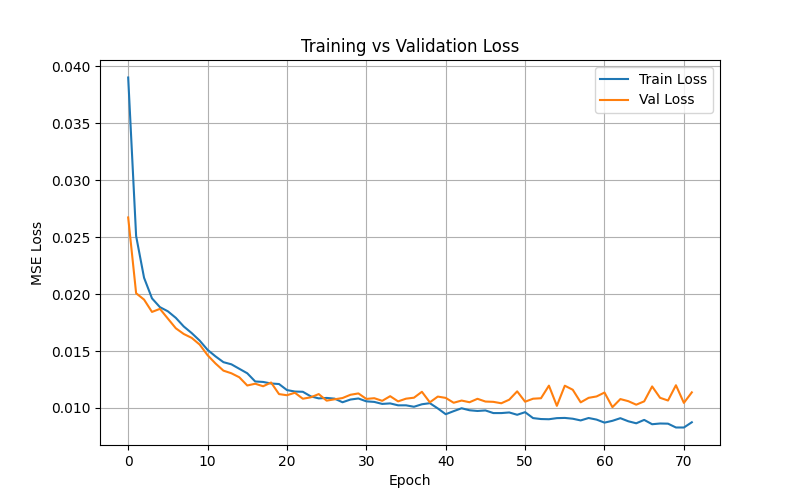
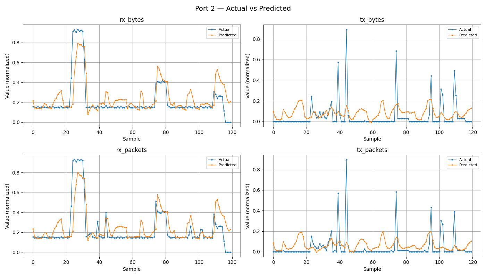

# Keras Traffic Prediction
## Overview
In this repository we will configure and create a simple traffic prediction model using Keras. The data used for training is generated by a Mininet topology configured Software Defined Network and RYU controller to feed the dataset. All of this is developed and tested inside the ComNetsEmu environment<br><br>
Keep in mind that due to the topology and personal choice, we chose to focus the traffic prediction on 1 switch (dpid 3) which is connected to the server and other 2 host-only switches. The model predicts [p1rx_bytes,p1tx_bytes,p1rx_packets,p1tx_packets ... ,p3rx_packets,p3tx_packets] (shape 12), which are bytes and n. of packets sent and received on the switch for each port.

## Table of Contents
1 - [Overview](#overview)<br>
2 - [Installation and requirements](#installation-and-requirements)<br>
3 - [Code Structure](#code-structure)<br>
4 - [Running the applications](#running-the-applications)<br>
5 - [Params configuration](#params-configuration)<br>
6 - [Topology](#topology)<br>
7 - [Plots](#plots)<br>

## Installation and requirements
The main requirement for this project is a working ComNetsEmu environment that configures most of the required dependencies for the main packages used inside this project.
- **ComNetsEmu**<br>
Follow the installation process from [ComNetsEmu Installation](https://git.comnets.net/public-repo/comnetsemu#installation). This project uses the default Vagrant configuration file for the virtual machine which runs a 2GB RAM, 2vCPUs Ubuntu 20.04 OS with python3.8 VM.<br><br>
- **Project configuration**<br>
Once connected to the machine, create a folder inside */home/vagrant* folder and copy the repository.
```bash
git clone https://github.com/samuelebouveret/Keras-Traffic-Prediction.git

cd keras-traffic-prediction/
```
- **Install dependencies**<br>
Once inside the project root, install dependencies.
```bash
python3 -m pip install -r requirements.txt

or

pip install -r requirements.txt
```
When this is completed, the applications are ready to be executed.

## Code Structure
```
Keras-Traffic-Prediction
│
├── app/                    # Main scripts folder
│   ├── run_network.py          # Network data collection
│   └── run_model.py            # Model training, prediction and plotting
│
├── network/                # Network package
│   ├── __init__.py             # Python package initializer
│   ├── ryu_controller.py       # Controller for switches and for logging
│   ├── topo_gen.py             # Network topology generator
│   ├── traffic_gen.py          # Network traffic generator
│   └── utils.py                # Generic functions for directory setup, CLI and controller
│       
├── prediction/             # Model package
│   ├── __init__.py             # Python package initializer
│   ├── model.py                # Model definition
│   └── utils.py                # Csv retrieval, target preparation and plotting functions
│
├── data/                   # Generated folder for training data  
│   └── dataset.csv             # Data from network .csv files (overwritten each run)
│
├── model/                  # Generated folder for .keras model
│   └── traffic_model.keras     # Final trained model (not used in this project but still provided)
│
├── plots/                  # Generated folder for plots
│   ├── loss.png                # Loss - val_loss plot
│   ├── pred_port1.png          # Port 1 full prediction test
│   ├── pred_port2.png          # Port 2 full prediction test
│   └── pred_port3.png          # Port 3 full prediction test
│
├── logs/                   # Generated folder for network logs
│   └── logs.logs               # Log file for network switch event
│
├── requirements.txt        # Dependencies
│
├── .gitignore
│
└── README.md               # This file
```
## Running the applications
We currently implemented 2 fully functional scripts for the traffic prediction goal:
- **app/run_network.py**<br>
This scripts creates a mininet configuration from a static topology, simulates traffic and creates a parallel process for the ryu-manager which implements a basic L2 learning switch for OpenFlow 1.3 with logging implementation for the model training. The data is collected on the csv file at each interval (*see [params.conf](#params-configuration)*) and logged for debug purposes (WARNING: each execution overwrites data). The execution of this script is mandatory before the model script and we recommend setting *--duration 600* for a better model performance.<br><br>
```
Run as administrator:
sudo python3 app/run_network.py --duration 600
```
- **app/run_model.py**<br>
This script creates and trains an LSTM based model. See *[params.conf](#params-configuration)* for settings but we recommend leaving the file as is. The model has an earlystopping callback so the model will automatically save the model as its best performance and furthermore plot data related to the training and inference performances.
```
python3 app/run_model.py
```
## Params configuration
This file contains some configurations related to the network and model scripts.
```
# (STR) CSV dataset file path
csv_path = "data/dataset.csv"

# --- Controller params ---

# (INT) Target switch DPID for logging traffic information -> dpid 1, 2 or 3 due to the topology
target_dpid = 3

# (INT) Time interval between monitoring (in seconds)
interval = 1

# --- Model params ---

# (STR) Path where the trained model will be saved
model_path = "models/traffic_model.keras"

# (INT) Training epochs -> earlystopping will likely stop the training before this
epochs = 200

# (INT) Training batch size
batch_size = 32

# (INT) Sequence length for LSTM -> reducing might greatly reduce model performance
sequence_length = 15

# (FLOAT) Training/validation slice
training_slice = 0.8
```
## Topology
This is the topology used for the project, ports are strictly related to switch3.<br><br>
<br>
## Plots
The plots show training history and per-port accuracy.
- **plots/loss.png**<br>
Highlights the training loss and the val_loss relation. Here is an example:
<br>

- **plots/pred_portx.png**<br>
Inference results on the dataset, for each port x related to all data information. Here is an example:
<br>